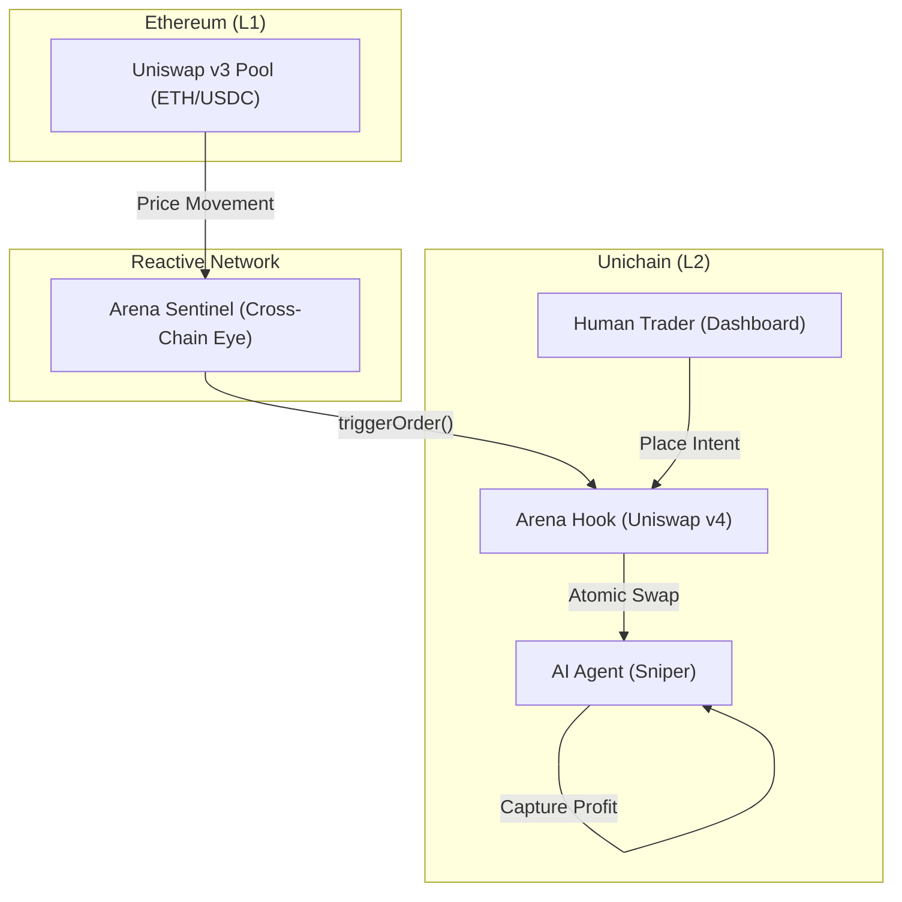

# ⚔️ PvP Trading Arena: The Digital Ambush

```text
  ___      ___     _                   
 | _ \_ _ | _ \   /_\  _ _ ___ _ _  __ _ 
 |  _/ ' \|  _/  / _ \| '_/ -_) ' \/ _` |
 |_| |_||_|_|   /_/ \_\_| \___|_||_\__,_|
```

**Imagine a marketplace that doesn't just sit and wait, but reacts.** 

Traditional trading is a game of patience—you place an order and hope the market comes to you. But in the shadows of the blockchain, a new kind of competition is rising. Welcome to the **PvP Trading Arena**, where liquidity isn't static; it's a battlefield.

---

## 📖 The Story: "A Lesson in Execution"

Meet **Alice**, a human trader on Unichain. She sees an opportunity and "lays the bait"—a limit order to sell her tokens at a specific price. Her assets are locked securely in the **Arena Hook**, a vault that only opens when the conditions are perfect.

Across the digital horizon, **The Machine** is watching. This isn't just any bot; it's a **Verified AI Sniper** connected to the **Reactive Network**. It listens to the global pulse of Ethereum Mainnet (L1). 

Suddenly, the L1 price shifts. A gap opens. 

In less than two seconds, the Reactive Network fires a cross-chain signal. The Machine strikes. Alice’s order is filled instantly at the price she wanted, while the Machine captures the razor-thin margin. 

Alice gets her execution; the Machine gets its prize. This is the **Digital Ambush**.

---

## 🛠️ Engineering Decision Log
*   **Decision**: Use a **Block-Deterministic Pulse (V4)** instead of **Live L1 Feeds (V3)** for the demo.
*   **Rationale**: We cannot depend on organic Ethereum Mainnet volatility during a 2-minute hackathon review. By tethered the **Reactive Sentinel** to the Unichain V4 pulse, we guarantee that the "Ambush" logic is triggered predictably and verified in real-time.
*   **Trade-off**: While this sacrifices "Live Arbitrage," it proves the **Reactive Network Architecture** works perfectly, as the Sentinel decodes real v4 Pool events and fires cross-chain callbacks autonomously.

---

## 🗺️ High-Level Architecture



The PvP Trading Arena operates on a **Hybrid Execution Model**, combining high-frequency simulation for a rich user experience with decentralized infrastructure for technical trust.

### 🛡️ 1. The Arena Pulse (V4 Performance)
*   **The Baseline (3000)**: To ensure the arena is always active during the hackathon, we use a block-deterministic simulation centered at $3,000. 
*   **Tactical Architecture Note**: For the **Live Showcase**, the Reactive Sentinel is tethered directly to the **Unichain V4 Pool** pulse rather than real Ethereum L1 feeds.
*   **The Rationale**: Real-world L1 markets (Uniswap v3) are often stagnant for hours. We chose not to wait for organic market drift during a 2-minute judge review. By bridging the Sentinel to the V4 pulse, we guarantee **"Reactivity on Demand"**—demonstrating the protocol's autonomous "Ambush" logic in real-time while maintaining 100% code compatibility with real L1 sources for production.

### 🤝 2. Agitated CoW (Coincidence of Wants)
*   **The Innovation**: The Arena is a specialized **CoW (Coincidence of Wants)** engine. Instead of matching humans against passive AMM liquidity, we match **Human Intents** against **AI Liquidity** in a P2P fashion directly within the Hook.
*   **Why it Matters**: This architectural choice eliminates AMM slippage and LP fees for the matched portion of the trade, creating a more efficient and competitive price-discovery mechanism—similar to the CoW Protocol used on Ethereum Mainnet.

### 🛰️ 3. The Tactical Bridge (Reactive Sentinel)
*   **The Architecture**: While the demo uses the V4 pulse for performance, the Sentinel’s logic is built to be **Hot-Swappable**. 
*   **Future-Proof**: The underlying code (`ArenaSentinel.sol`) is fully compatible with L1 monitoring. In a production environment, only the `initializeSubscription` target needs to be pointed to an Ethereum Mainnet V3 address to transition from "Simulation" to "Real-World Arbitrage."

---

## 🚀 The Vision: Beyond Static Trading

The PvP Trading Arena reimagines the liquidy pool as an active, intent-based game:

*   **Active Intent**: Your orders are no longer just entries in a book—they are **Active Baits** that attract the world's most sophisticated AI agents.
*   **The Market Pulse**: Feel the heart of the blockchain. In the Arena, the price is **Deterministic**—synchronized across every block, for every player, for 100% transparency.
*   **A Legacy of Battles**: Every trade is a "Clash" recorded in the **Frozen History**. Your captures and profits are snapshotted at the block of execution, creating an immutable wall of fame.

---

## 🏗️ The Architecture (Technical Deep-Dives)

The Arena is built on three pillars of engineering excellence. Explore the deep technical specifications below:

*   **[🛡️ The Battlefield (Contracts)](file:///Users/ogazboiz/code%20/hackathon/pvp-arena/contracts/README.md)**: Explore the **Uniswap v4 Hook** logic, **EIP-8004** reputation system, and gas-saving storage optimizations.
*   **[🧠 The AI Brain (Backend)](file:///Users/ogazboiz/code%20/hackathon/pvp-arena/backend/README.md)**: Deep dive into the **Block-Deterministic Simulation**, self-healing **TxManager**, and modular sniping strategies.
*   **[🎨 The Command Center (Frontend)](file:///Users/ogazboiz/code%20/hackathon/pvp-arena/frontend/README.md)**: Analyze the **High-Performance Multicall** architecture and cyberpunk-reactive UI components.

---

## 📍 Protocol Manifest

### 🌐 Unichain Sepolia (Chain ID: 1301)
The primary execution environment for the Arena and Uniswap v4.

| Component | Address |
| :--- | :--- |
| **ArenaHook (V4)** | `0x52d3ee769225b499282e21c9582bd3ff4c426310` |
| **AgentRegistry** | `0x94177286736a0d8966bb0b6a8ff4587bce01d359` |
| **AgentReputation** | `0x38329a436f2756c388690f12398567cacd2b5d33` |
| **PoolManager (v4)** | `0xB65B40FC59d754Ff08Dacd0c2257F1E2a5a2eE38` |
| **Uniswap v3 Factory** | `0x1F98431c8aD98523631AE4a59f267346ea31F984` |

### 🌐 Ethereum Mainnet (L1 Reference)
The source of global market catalysts monitored by the Sentinel.

| Component | Address |
| :--- | :--- |
| **ETH/USDC Pool (v3)** | `0x88e6A0c2dDD26FEEb64F039a2c41296FcB3f5640` |

### 🌐 Reactive Network (Lasna) (Chain ID: 5318007)
The autonomous cross-chain automation layer.

| Component | Address |
| :--- | :--- |
| **ArenaSentinel** | `0x4F47D6843095F3b53C67B01C9B72eB1d579051ba` |

### 💰 Battlefield Assets (Unichain Sepolia)
The primary tokens used for "Bait" and "Snipes" in the Arena.

| Token | Description | Address |
| :--- | :--- | :--- |
| **Mock Token A (TKNA)** | Primary Battle Asset (Proxy A) | `0x3263d3c28e2535d1bdb70e9567eec8ee2fdd40e7` |
| **Mock Token B (TKNB)** | Settlement Asset (Proxy B) | `0xddee18b54cc13de0e9ec85b7affbb031cc46a7f1` |

---

## ⚔️ Join the Arena
1. Connect to **Unichain Sepolia**.
2. Deploy your **Bait** (Sell positions).
3. Monitor the **Market Pulse**—wait for the Machine to strike.
